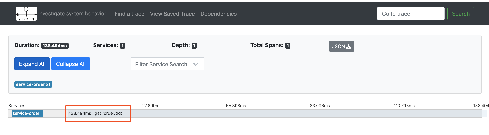

## zipkin是什么

Zipkin是一款开源的分布式实时数据追踪系统（Distributed Tracking System），基于 Google Dapper的论文设计而来，由 Twitter 公司开发贡献。其主要功能是聚集来自各个异构系统的实时监控数据。分布式跟踪系统还有其他比较成熟的实现，例如：Naver的Pinpoint、Apache的HTrace、阿里的鹰眼Tracing、京东的Hydra、新浪的Watchman，美团点评的CAT，skywalking等。


## 为什么使用Zipkin

随着业务越来越复杂，系统也随之进行各种拆分，特别是随着微服务架构和容器技术的兴起，看似简单的一个应用，后台可能有几十个甚至几百个服务在支撑；一个前端的请求可能需要多次的服务调用最后才能完成；当请求变慢或者不可用时，我们无法得知是哪个后台服务引起的，这时就需要解决如何快速定位服务故障点，Zipkin分布式跟踪系统就能很好的解决这样的问题。


## zipkin架构


如图所示，Zipkin 主要由四部分构成：收集器、数据存储、查询以及 Web 界面。Zipkin 的收集器负责将各系统报告过来的追踪数据进行接收；而数据存储默认使用 Cassandra，也可以替换为 MySQL；查询服务用来向其他服务提供数据查询的能力，而 Web 服务是官方默认提供的一个图形用户界面。

而各个异构的系统服务向 Zipkin 报告数据的架构如下图。


可以看出，各个系统都可以向zipkin发送trace信息。


## Brave

Brave 是用来装备 Java 程序的类库，提供了面向 Standard Servlet、Spring MVC、Http Client、JAX RS、Jersey、Resteasy 和 MySQL 等接口的装备能力，可以通过编写简单的配置和代码，让基于这些框架构建的应用可以向 Zipkin 报告数据。同时 Brave 也提供了非常简单且标准化的接口，在以上封装无法满足要求的时候可以方便扩展与定制。

如下图是Brave的结构图。Brave利用reporter向zipkin的Collector发送trace信息。


## Zipkin在dubbo中的使用

dubbo作为一个rpc框架广泛应用于分布式应用中，随着业务的越来越复杂，一次请求的调用链也会变得繁杂，如何清晰的展示一次请求的调用链？结合Zipkin，可以方便的展示dubbo服务调用关系链。

下面通过一个实际的例子展示dubbo应用如何使用zipkin追踪请求的调用链。Brave使用起来不是很方便，编码量有些大，而利用Spring Cloud的sleuth组件可以很方便地使用brave，将trace数据通过http，Kafka或rabbitmq发送给zipkin。所以在本例中将采用将trace数据通过kafka发给zipkin。

为了快速搭建zipkin的环境，本例采用docker的形式搭建zipkin和kafka。

### zipkin 环境搭建

docker-compose.yml 内容如下：

```yml
version: '2'

services:
  storage:
    image: openzipkin/zipkin-mysql
    container_name: mysql
    ports:
      - 3306:3306

  ## kafka
  kafka-zookeeper:
    image: openzipkin/zipkin-kafka
    container_name: kafka-zookeeper
    ports:
      - 2181:2181
      - 9092:9092
  zipkin:
    image: openzipkin/zipkin
    container_name: zipkin
    environment:
      - STORAGE_TYPE=mysql
      - MYSQL_HOST=mysql
      - KAFKA_BOOTSTRAP_SERVERS=kafka-zookeeper:9092
    ports:
      - 9411:9411
    depends_on:
      - storage
      - kafka-zookeeper
      
  dependencies:
    image: openzipkin/zipkin-dependencies
    container_name: dependencies
    entrypoint: crond -f
    environment:
      - STORAGE_TYPE=mysql
      - MYSQL_HOST=mysql
      - MYSQL_USER=zipkin
      - MYSQL_PASS=zipkin
    depends_on:
      - storage
```


如上所示，本例将采用mysql作为zipkin的存储，也可替换成别的存储如：es等等。

启动上面的docker-compose文件。启动完成。可以访问路径localhost:9411，可以看到如下页面。


### 搭建一个dubbo分布式应用


首先搭建一个dubbo的项目。


service-order 依赖 service-user项目。当查询订单详情的时候order服务会去调用user模块获取用户详情。service-user-dubbo-api是user服务定义模块。

### spring mvc 接入zipkin

在service-order和service-user中添加maven引用。

```:nine:
 <dependency>
      <groupId>org.springframework.cloud</groupId>
      <artifactId>spring-cloud-starter-zipkin</artifactId>
    </dependency>

    <dependency>
      <groupId>org.springframework.kafka</groupId>
      <artifactId>spring-kafka</artifactId>
    </dependency>
```


 spring-cloud-starter-zipkin 封装了了brave的操作。


在zipkin的brave仓库中，zipkin对各个接入端做了集成的封装。方便各个接入端快速接入。如下图：


地址：https://github.com/openzipkin/brave/tree/master/instrumentation

在service-order和service-user添加相关配置：（只列出service-user，service-order类似）

```:nine:
dubbo:
  protocol:
    port: 20881
    name: dubbo
    id: dubbo
  application:
    name: service-user
  registry:
    protocol: zookeeper
    address: me.com:2181
  scan:
    base-packages: com.lenny.sample.user.service


spring:
  # 启用sleuth
  sleuth:
    enabled: true
    sampler:
      probability: 1
  zipkin:
    sender:
      type: kafka #向kafka发送trace信息
  #kafka配置
  kafka:
    bootstrap-servers: PLAINTEXT://me.com:19092
  application:
    name: service-user
```

此时访问service-order的获取订单详情的接口 http://me.com:8081/order/1，此时在zipkin中会出现一条trcace记录。和清楚地看出是访问/order/1产生的trace信息。



下面讲解brave-instrumentation的spring mvc 如何将springmvc访问接入到zipkin中的。


TraceWebServletAutoConfiguration 会在spring boot项目启动的时候，自动加载，通过FilterRegistrationBean将TracingFilter过滤器注入到容器中。这样每次请求都会过TracingFileter过滤器。


 在doFilter的时候将访问信息发送给zipkin。 详细代码不做解释了。

### dubbo 接入到zipkin

上面的访问订单详情的接口通过dubbo访问了user模块的获取用户信息的远程接口，但是该访问并没有记录到zipkin上。想要让dubbo的访问记录也发送到zipkin上，形成完整的调用链，该怎么做呢？

在brave-instrumentation中有个dubbo-rpc的库，这个库就是将dubbo访问信息记录zipkin的brave封装。 spring-cloud-starter-zipkin默认并没有引入该类库。

首先我们引入该类库。

在service-order和service-user模块maven中添加如下应用：

```:nine:

    <dependency>
      <groupId>io.zipkin.brave</groupId>
      <artifactId>brave-instrumentation-dubbo-rpc</artifactId>
      <version>5.6.0</version>
    </dependency>
```

修改server-order和service-user配置文件,在dubbo节点下增加如下配置。

```:nine:
dubbo:
  consumer:
    filter: 'tracing'
  provider:
    filter: 'tracing'
```

重启service-order和service-user，再次访问http://me.com:8081/order/1

发现新的请求调用链包含service-order和servicice-user。点击调用链，显示调用详情。


dubbo接入zipkin原理：

dubbo提供了spi扩展机制，继承dubbo的Filter。即可在dubbo调用方法之前执行一些操作。类似java web的filter机制。

brave-instrumentation-dubbo-rpc中提供了一个brave.dubbo.rpc.TracingFilter,在并配置了filter。（关于dubbo的spi机制在这了不做详细的解释）


在配置文件的dubbo节点下面配置

```:nine:
dubbo:
  consumer:
    filter: 'tracing'
  provider:
    filter: 'tracing'
```

当请求到达消费端和服务提供端的时候都会向zipkin发送trace信息。


## 总结

本文从以下几点讲解了dubbo分布式应用中如何做zipkin链路追踪。

1. zipkin介绍
2. zipkin环境搭建
3. zipkin在spring mvc的中使用与基本原理
4. zipkin在dubbo中的使用以及基本原理
